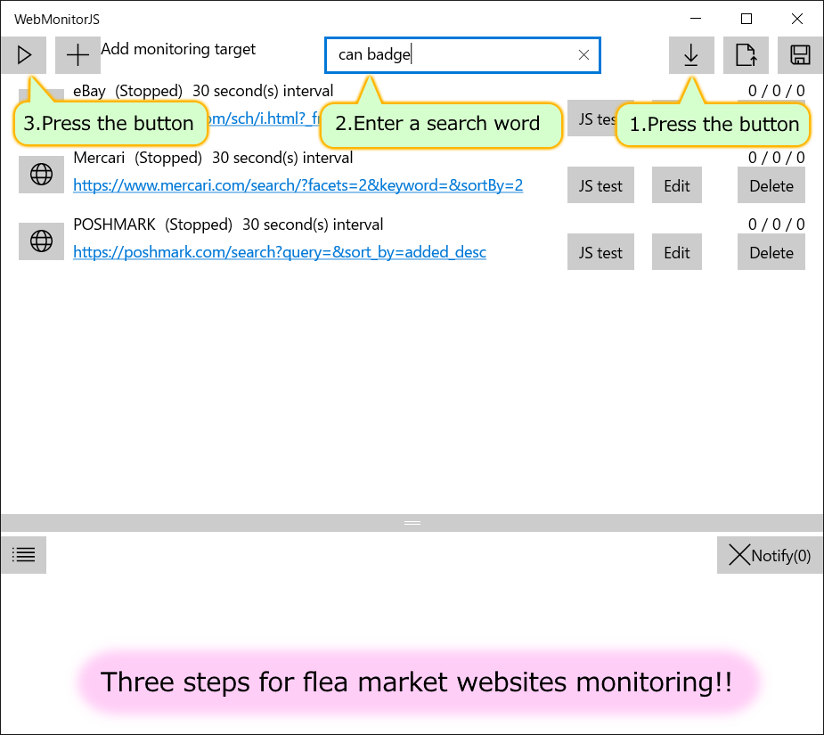

# I want to buy deal goods at flea market websites faster than anyone else!
There are many people who sell deal goods on flea market websites, but such goods are already sold out when they are searched and found.  
In order to buy deal goods, you must check and purchase the goods earlier than others.  
If you follow the method described here, you will be able to regularly monitor new goods for sale and make quick purchases.

You can buy deal goods by using "WebMonitor JS" introduced here.  
"WebMonitorJS" is an application for Windows 10 distributed by Microsoft Store, so it can be used on a PC.  
Because the actual search is not performed on the server but on the computer you are using, you will be notified immediately when the listing is made.  
You can specify the monitoring contents of the monitored website in JavaScript, so you can add a new site.  
However, in this case, JavaScript programming skills are required. Well-known flea market websites can be monitored just by reading the default settings, so you can use it without JavaScript skill.

When aiming for deal goods on flea market sites, we often miss the purchase with a delay of 1 minute and 1 second after listing.  
"WebMonitorJS" is rarely sold out when notified, and I myself use this to get a lot of deal goods.
(Although it may be bought while hesitating to buy ...)  
If you want to buy smartly at flea market websites, please try "WebMonitorJS".

Now, I will explain the procedure to monitor the flea market websites.

## First, install "WebMonitorJS"
"WebMonitorJS" is an application for Windows 10 distributed by Microsoft Store.  
This is a paid app, but you can use it for a trial because it can be used for free for 7 days.  
Please install from the "Free Trial" at the top of the page below.  
[https://www.microsoft.com/store/apps/9P29HWB7RX0R](https://www.microsoft.com/store/apps/9P29HWB7RX0R)

## There are only three steps for a famous flea market websites!
With the following famous flea market websites, you can set the monitoring just by loading the default settings.  
- eBay (Buy it now)
- Mercari
- POSHMARK

The setting method is as shown in the image below.

1. First, click the download button of the default settings in the upper right of the screen to load the settings.  
Since the settings are downloaded from the Web, please do so while connected to the Internet.
2. Enter the search word of the product you want to search in the text box at the top of the screen.  
For example, if you want to monitor related goods of "iPhone", enter "iPhone" in the text box.
3. This completes the settings. Finally, press the start button at the top left of the screen. This will start monitoring.

If you follow the above steps, you will be notified on the screen when a new goods is listed.  
By default, the monitoring interval is 30 seconds.  
If it seems that it is often sold out at the time of notification, try shortening the monitoring interval from the edit screen.  
However, if you set the interval too short, it will put a load on the monitored website, so let's set it so that the website is not disturbed.

