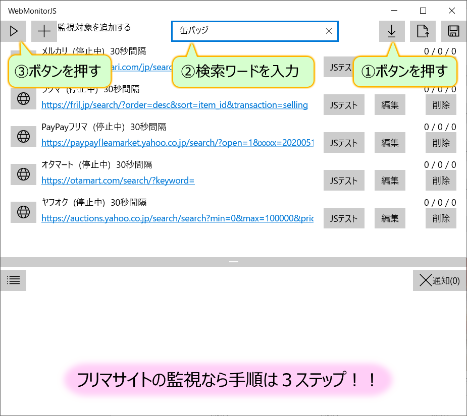

# フリマサイトでお買い得な商品を誰よりも早く買いたい！
フリマサイトにはお買い得な安い商品を出品する人も多いですが、そのような商品は検索して見つけた時には既に売り切れています。  
お買い得な商品を買うためには、他の人よりも早く商品を確認して購入しなければいけません。  
ここで説明する方法を実践すれば、出品された新着商品を定期的に監視し、素早く購入することができるようになります。

スマホであれば、フリマウォッチやフリマアラートといった有名なアプリがあります。
ただし、スマホアプリなので当然スマホが必要で、パソコンでは使用することができません。  
また、これらのアプリは、検索自体は提供者のサーバで実行されているため、商品が出品されてから実際に通知されるまでに時間差があります。
さらに、メルカリ等の監視対象のサイトの仕様が変わった場合、提供者が対応してくれないと通知自体が行われません。

このような問題点を解決するアプリが、こちらで紹介している「WebMonitorJS」です。
「WebMonitorJS」は、MicrosoftStoreで配信されているWindows10向けのアプリケーションですので、パソコンで使用することができます。  
また、実際の検索にをサーバ等では行わず、使用しているパソコンで行うため、出品が行われた時点で即時通知されます。  
監視対象のサイトの監視内容をJavaScriptで指定できるので、サイトの仕様が変わった、新しいサイトを追加したい、といったことも自由に対応可能です。  
ただし、この場合はJavaScriptをプログラミングするスキルが必要となります。有名なフリマサイトであれば、デフォルト設定を読み込むだけで監視できるので、JavaScriptのスキルが無くても使用することができます。

フリマサイトのお買い得商品を狙う場合、出品されてから1分、1秒の遅れで買い損ねることが多々あります。  
フリマウォッチやフリマアラートでは、通知された時点で既に売り切れているといったコメントも多くあります。  
「WebMonitorJS」では、通知された時点で売り切れていることは少なく、私自身もこれを使ってお買い得商品を多くゲットしています。
（購入を迷っている間に買われてしまうことはありますが。。。）  
フリマサイトで賢くお買い物をしたい方は、「WebMonitorJS」をぜひお試しください。

それでは、フリマサイトを監視する手順を以下で説明していきます。

## まずはWebMonitorJSをインストールする
「WebMonitorJS」はMicrosoftStoreで配信している、Windows10向けのアプリケーションです。  
こちらは有料アプリとなっていますが、7日間は無料で使用できるため、お試しで使用することができます。  
以下のページ上部にある「無料試用版」からインストールしてください。  
[https://www.microsoft.com/store/apps/9P29HWB7RX0R](https://www.microsoft.com/store/apps/9P29HWB7RX0R)

## 有名なフリマサイトなら手順は3つだけ！
以下の有名なフリマサイトであれば、デフォルトの設定を読み込むだけで監視の設定が行われます。  
- メルカリ
- ラクマ
- PayPayモール
- ヤフオク（即決のみ）
- オタマート

設定方法は、以下の画像の手順になります。

1. 最初に画面右上にあるデフォルト設定のダウンロードボタンを押して、設定を読み込んでください。  
Webから設定ダウンロードするため、インターネットに接続された状態で実施してください。
2. 検索したい商品の検索ワードを画面上部のテキストボックスに入力してください。  
例えば、最近人気の"鬼滅の刃"のグッズを監視したい場合は、テキストボックスに「鬼滅の刃」と入力してください。
3. ここまでで設定は完了です。最後に、画面左上の開始ボタンを押します。これで監視が開始されます。

上記の手順を行えば、あとはパソコンを動作させておくだけで、新しい商品が出品されたら画面に通知されます。  
なお、デフォルト設定では監視間隔を30秒としています。
もし、通知時点で売り切れになっていることが多いようであれば、編集画面から監視間隔を短くしてみてください。  
ただし、間隔を短くしすぎると、監視対象サイトに負荷をかけることになるため、サイトに迷惑がかからない程度で設定しましょう。
